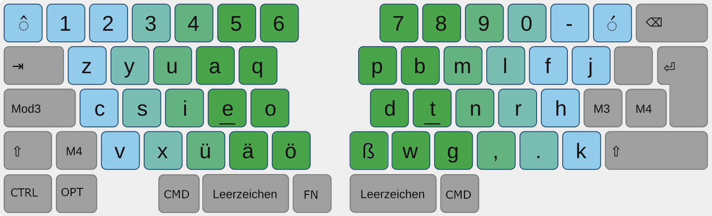

# Content

<!-- TOC -->

- [Content](#content)
- [My Keyboard Setup](#my-keyboard-setup)
  - [Layer 1](#layer-1)
  - [Layer 2](#layer-2)
  - [Layer 3](#layer-3)
  - [Layer 4](#layer-4)
- [My Keyboard(s)](#my-keyboards)
  - [Keychron Q10 Pro](#keychron-q10-pro)
  - [Keychron K11 Max](#keychron-k11-max)
- [Karabiner Elements](#karabiner-elements)

<!-- /TOC -->

# My Keyboard Setup

I'm typing on a slightly modified [Noted](https://github.com/dariogoetz/noted-layout) layout by @dariogoetz. Noted itself is based on https://neo-layout.org/.

Generally I kept all the letters as on notes, omitted changes to the number row and also skipped all dedicated Layer 2 differences resulting in these layouts.

## Layer 1

## Layer 2

This is just regular layer 1 with Shift in my case

## Layer 3

## Layer 4

# My Keyboard(s)

I'm using a Keychron Q10 Pro (ISO) as well as a Keychron K11 Max (Ansi) right now.

Both keyboards are programmed with the whole layout in hardware so no drivers or compatibility issues. That is also the reason for no dedicated layer2 as I would need to code a lot of macros instead os just using VIA. I also do not need the special characters that I miss on (Used 3 in 10 years maybe)

The keyboards are programmed in a way that they act as a regular german DE-QUERTZ layout so also no need to switch system do ANO En or anything. No need for Umlaut Macros etc.

Downside. The layout files contain the ansi codes for the proper chars on german driver layouts which is a bit tricky to read.

Very helpful resource is also: https://mechanische-tastaturen.net/qmk-und-via-guide/qmk-via-keycodes-fuer-deutsche-zeichen/

## Keychron Q10 Pro

Layout file: [noted-hybrid/q10-iso.layout.json](noted-hybrid/q10-iso.layout.json)

**Custom Keycaps:**

I made custom keycaps on https://yuzukeycaps.com/c/db0bdf94-f2b2-45e7-a158-573784411107

## Keychron K11 Max

Layout file: [noted-hybrid/k11-iso.layout.json](noted-hybrid/k11-iso.layout.json)

# Karabiner Elements

I did fiddle a bit with Karabiner and just configures Layer 1 tbh. Anyway its here: [/Users/fkappes/keyboard/noted-hybrid/karabiner.json](/Users/fkappes/keyboard/noted-hybrid/karabiner.json)
